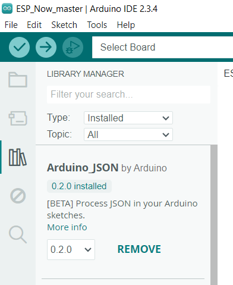

# Energy-Efficient IoT Sensor Network for Weather Monitoring

This repository provides setup instructions to configure and deploy the **Energy-Efficient IoT Sensor Network for Weather Monitoring**. The focus is exclusively on **code setup** and software dependencies required to run the system. Detailed system architecture, hardware details, and functionality explanations are covered in our [project blog](http://iotbmproject.netlify.app/).

---

## Prerequisites

### Required Software
1. **Arduino IDE**: [Download here](https://www.arduino.cc/en/software)  
2. **Python 3.x**: Ensure Python is installed and accessible via your system PATH [Download here](https://www.python.org/downloads/) 
3. **Node-RED**: [Installation Guide](https://nodered.org/docs/getting-started/)  
4. **MongoDB Community Edition**: [Download here](https://www.mongodb.com/try/download/community)

---

## Required Libraries and Dependencies

### Arduino Libraries
Manually install the following libraries using the links or directly from the Arduino Library Manager:
1. **MQTT**: [PubSubClient Library](https://pubsubclient.knolleary.net/)  
2. **DHT**:
   - [DHT Library 1](https://github.com/dhrubasaha08/DHT11)  
   - [Adafruit DHT Sensor Library](https://github.com/adafruit/DHT-sensor-library)  
3. **ArduinoJson**:
   - [Official ArduinoJson](https://arduinojson.org/?utm_source=meta&utm_medium=library.properties)  
   - [Arduino JSON GitHub](https://github.com/arduino-libraries/Arduino_JSON)

> **Tip**: Use the Arduino Library Manager for easier installation. Navigate to `Tools > Manage Libraries`, search for the library, and click "Install."


### Python Dependencies
Install the required Python packages via pip:
```bash
pip install paho-mqtt pyserial
```

---

## Setup Instructions

### 1. Arduino Code Setup
#### Master Code
1. Open the **master code**: [Code](src/ESP_Now_master/ESP_Now_master.ino) in the Arduino IDE.
2. Install the required libraries listed above.
3. Replace the `slaveAddress` array with the MAC addresses of your slave ESP32 devices.
4. Upload the code to the **Master ESP32**.

#### Slave Code
1. Open the **slave code**: [Code](src/ESP_Now_slave/ESP_Now_slave.ino) in the Arduino IDE.
2. Install the required libraries listed above.
3. Replace the `masterAddress` variable with the MAC address of the Master ESP32.
4. Replace in the void loop `String sensor_id = "sensor1"` variable to match for each of the slaves devices before uploading ie. sensor2 or sensor3 for identity purpose.
5. Upload the code to each **Slave ESP32**.

---

### 2. Python Code Setup
1. Update the Python script: [Code](src/port_listner_script.py)
   - Set the `SERIAL_PORT` to the appropriate port (e.g., `MAC(/dev/ttyUSB0)` or `WINDOWS(COM3)`).
   - Replace the `MQTT_BROKER` with your desired MQTT broker address.
   - Modify MQTT Topics to your unique identifier style if necessary.
2. Run the script:
   ```bash
   port_listner_script.py
   ```
3. The Python script handles:
   - Communication with the Master ESP32 via Serial.
   - Relaying updates and sensor data to/from the MQTT broker.

---

### 3. MongoDB Setup
1. Install **MongoDB Community Edition** from the [official MongoDB website](https://www.mongodb.com/try/download/community).
2. Configure MongoDB to store weather data. Ensure it is running locally or on a designated server.

---

### 4. Node-RED Setup

1. Install Node-RED by following the [official guide](https://nodered.org/docs/getting-started/).
2. Install the required modules:
   - Open Node-RED and navigate to `Manage Palette` from the menu.
   - Search for and install the following modules:
     - `node-red-node-mongodb` (version 0.2.5)
     - `node-red-dashboard`
     - `node-red-contrib-mqtt-broker`
3. Import the Node-RED flows:
   - Locate the JSON files in the `node-red-flows/` folder of this repository or [Code](node-red-flows/main.json)
   - In Node-RED, go to the menu, select `Import`, and load the JSON file.
4. Configure MQTT nodes:
   - Set the broker address in the MQTT nodes to match the one used in the Python script.
5. Deploy the flows and:
   - Access the Node-RED Dashboard to view and interact with the system's graphical interface.
   - Ensure the MongoDB node configuration matches the MongoDB database you set up.

---

## Debugging and Logs

### Arduino Serial Logs
- Use the Arduino Serial Monitor or another Serial interface to view logs from the ESP32 devices.

### Python Script Logs
- Displays incoming MQTT messages and Serial interactions with the Master ESP32.

### MQTT Broker
- Use an MQTT client (e.g., [MQTT Explorer](https://mqtt-explorer.com/)) to monitor topics:
  - Sensor Data: `d:/group5.iot/status`
  - Configuration Updates: `d:/group5.iot/sampling_interval`, etc.

---

## Notes
- Ensure that all MAC addresses are correctly assigned in the code.
- Confirm that MongoDB and Node-RED configurations align with the broker and data flow settings.

---
